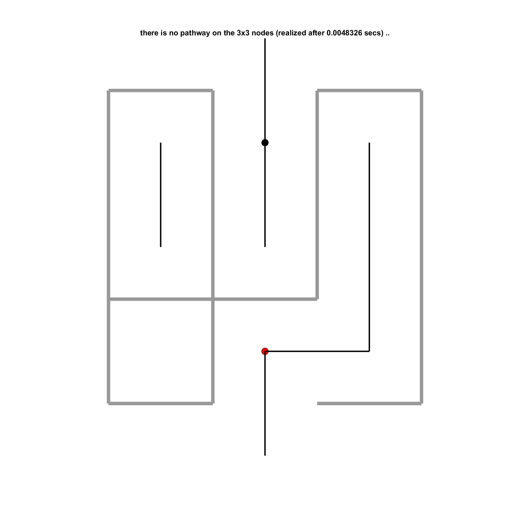
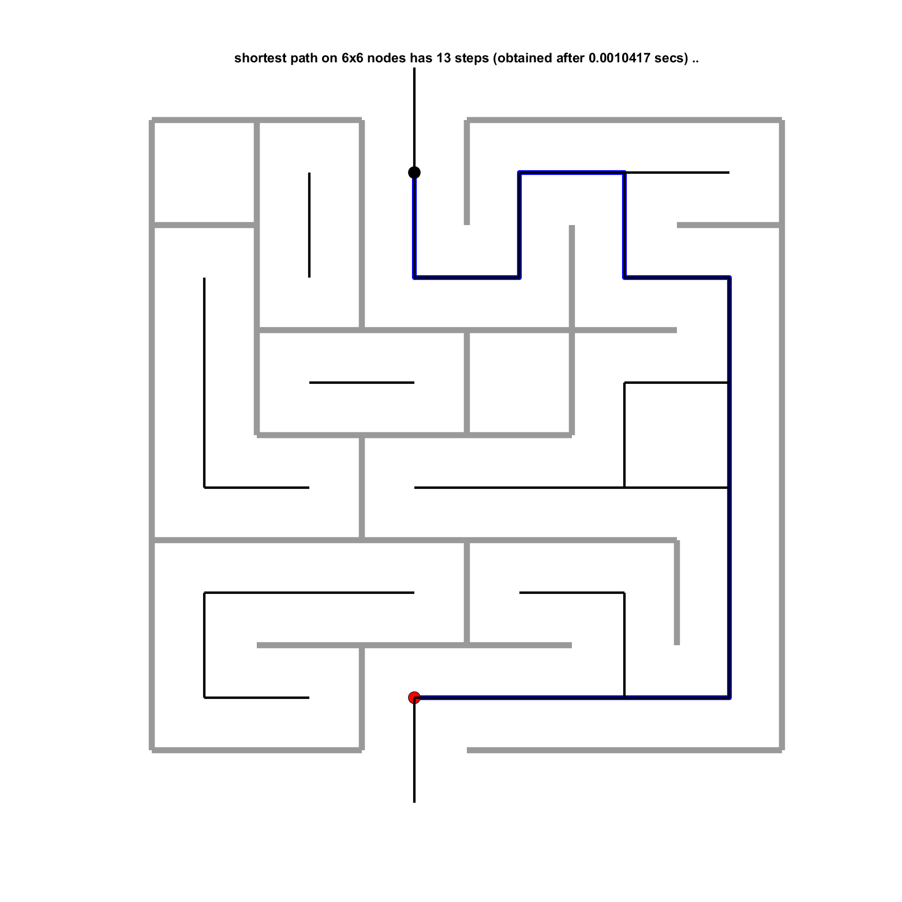
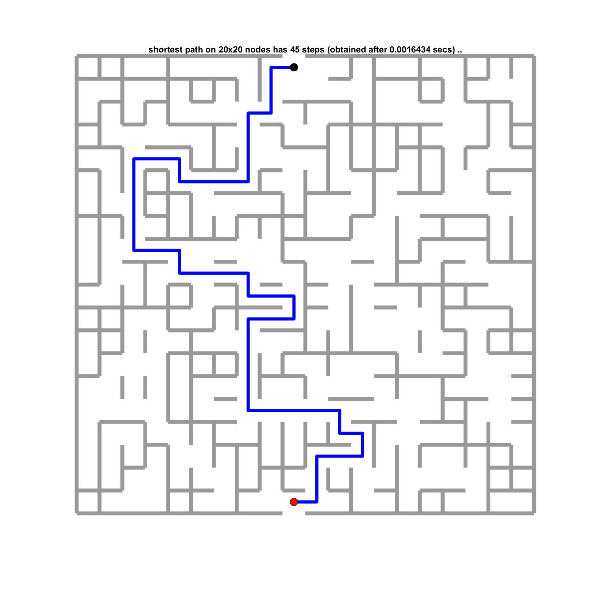

# CTL-labyrinth

related reference: https://journals.aps.org/pre/abstract/10.1103/PhysRevE.84.046703

Consider a regular two-dimensional *N* x *N* grid of nodes (grid constant 1) that serve to connect the pathway. i.e., one visits adjacent nodes while walking through a maze. Each of the *N*2 nodes has four next neighbors to which it can either be connected by a bond (active bond), or unconnected (passive bond). Boundary nodes have passive bonds that point outwards the grid, with the exception of the maze entry and exit bonds that are connected to the outside world (lets call the two bonds active "external" bonds, for reasons that will become clear later). If one enters a maze through the external bond one immediately meets a node, the so-called entry node. As soon as one has reached the exit node, one can use the exit bond to leave the maze. 

Here is an example for *N=3*. The entry and exit nodes are marked by black and red circles, respectively. Ignore the gray walls for a moment and watch the black lines connecting bonded nodes. The entry and exit nodes have external bonds that leave the system, ignore them as well. There are then *N*2=9 nodes left, residing on a regular *3* x *3* grid, some of them connected by bonds (black lines) to neighboring nodes. In the bottom left, one of the nodes is not visible, as it has no bonds attached to it. There are 5 active internal bonds shown in this picture (out of 12 internal bonds in total), plus the two external bonds. The 17 passive bonds are not shown (10 passive boundary bonds, 7 passive internal bonds). Obviously, this maze has no solution as there is no connected path from the entry to the exit. The gray walls have only been added to guide the eye. They can be drawn using all 17 passive bonds, the wall length therefore equals the number of passive bonds.  

Node positions within a labyrinth may be denoted by a pair (*x,y*), where *x* and *y* are integers in 1,..,*N*. A labyrinth is therefore specified by *N*, the entry and exit pairs such as *n*entry=(2,1) and *n*exit=(2,*N*), and a number of active bonds between two pairs like (1,2)<->(1,3) and (2,1)<->(3,1). There are 2*N(N+1)* bonds in total. As described, *4N-2* of the *4N* boundary bonds are passive (all but the entry and exit bonds), the remaining bonds can be either active or passive. In case there are one or more pathways through the maze, the code returns a sequence of bonded node positions for the shortest pathway, starting at *n*entry and ending at *n*exit, and visualizes the pathway within the maze. If there is no pathway, the code should inform the user that there is no solution, and draw the maze, so that users can convince themselves about the proper functionality of your maze solver. Moreover, the code should report the computing time spent to find the solution, or the negative answer. 

Here is another example, now for *N=6*. This time, there are connected pathways from the entry to the exit, the shortest one is marked in blue. 30 out of the 60 internal bonds are active, the shortest path occupies 13 of them. Because the grid has *2N(N+1)=84* bonds in total, there are *84-30-2=52* passive bonds, that give rise to the gray wall of length 52.

The last example, now for *N=20*. Here, we did not plot all active bonds, but kept the walls and the shortest path. The cpu time used to find the solution is reported in the figure title.

Your code should contain at least the following functions, while the main program can be used to ask a user for value of *N* and *p*, or also the application number.  

## def create_labyrinth(N,p)

  This function creates and returns *n*entry, *n*exit, and a number of actively bonded pairs of nodes by randomly choosing, with *p=50%* probability, internal bonds to be active. There are *2N(N-1)* internal bonds in total so that one may end up with a labyrinth that has about *N(N-1)* active internal bonds (for *N=3*, this makes *6* active internal bonds on average). Using this simple algorithm, some mazes may remain unsolvable, others may have several different solutions, there might also be loops and nodes that cannot be reached from the entry.  

## def draw_active_bonds(..)
  adds all active bonds as straight black lines to the figure.

## def draw_passive_bonds(..)
  adds all passive bonds as straight, light-grey lines (helpful for the debugging of your code) to the figure.

## def draw_walls(..)
  adds all the walls to the figure. 

## def calculate_shortest_path(..)
  returns a sequence of node positions, in case the maze can be solved, as well as the cpu time needed to find this sequence. If the maze cannot be solved, this routine returns the cpu time it spent for finding out that there is no solution. This routine adds the cpu time to the figure.
  
## def draw_shortest_path(..)
  adds the blue shortest path to the figure, in case a shortest path was found.

## def_solvable_fraction(N,p)
  For given *N* and *p*, it returns the average number of trials to generate a solvable maze.

## def application1
  create_labyrinth, draw it, save the figure (and include such figure(s) for some *N* and *p* into your report.md; show at least two figures, one with a solvable maze, another one showing an unsolvable maze).

## def application2
  create a solvable labyrinth, find the shortest path, draw the labyrinth including the shortest path, save the figure (and include such figure for some *N* and *p* into your report.md)

## def application3
  Calculate the solvable fractions for *N=5,10,50* and *p=0.2,0.3,0.5* (at least these 9 cases). Add the values into a table in your report.md 

## def application4(p)
  performs a speed test for a given value of probability *p*. To this end, vary *N* between 3 and 100 (or larger). For each *N* create a labyrinth that can be solved, calculate its shortest path, and record the required cpu time (in units of seconds, make sure you calculate the cpu time spent in the calculate_shortest_path function, as mentioned above already). Then plot cpu time versus *N* and determine the functional form of this curve (you may fit it using a polynomial and report the polynomial for some *p* like *p=0.2* or *p=0.5* in your report.md, or fit manually and add the fitting line or curve to the plot and report your findings in report.md). 
